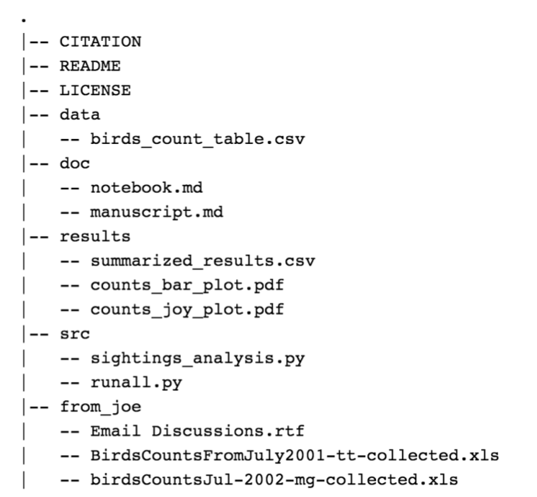

# Cookie Cutter for Data Analysis Project Structure

Written by Daniel Raff, with help from those in the Citation section below. Created 2017-11-16.  

See `cookie_cutter.sh` script - running this bash script will create the data analysis project structure in the directory it is run into. 

* Script will prompt for the name of the project - please use proper naming conventions (no whitespace, avoid camelcase). Use `_` if more than one word long. 

* Directory containing `cookie_cutter.sh` must be added to the PATH. This can be done by: 

> 1. search within home directory for a variation of `.bash_`. Mine is `.bash_profile`. 
> 2. Here add the directory to your bash profile with: `export PATH="~/PATH_TO_YOUR_DIRECTORY:$PATH"`
	* Generally: 
		* if you are using Mac or Windows
atom: `~/.bash_profile`
		* if you are using Linux
atom `~/.bashrc` 
	* Other Examples Include:  
		a. `/etc/profile`  
		b. `~/.bash_profile`  
		c. `~/.bashrc`  
		d. `~/.bash_login`   
		e. `~/.profile`
> 3. Now you will be able to run the script in the desired folder for your project with `bash cookie_cutter.sh` 

* Script will create a project structure resembling the following1:

`data` directory: Only raw data and metadata. These files are *not* to
be modified.

`doc` directory: text documents (eg: manuscripts, documentation, record of experiments)

`results` directory: intermediate results, cleaned data, final results, etc.

`src` directory: project source code

`misc` directory (in above diagram this is `from_joe`): Anything that is of poor quality and/or doesn't fit in above directories.

## Citation

Created Project Structure based on: 

1 DSCI 522 Lecture by Tiffany Timbers  
2[https://github.com/bdcaf/cookiecutter-r-data-analysis](https://github.com/bdcaf/cookiecutter-r-data-analysis)

